# VulnXposer

VulnXposer is a web-based vulnerability scanning platform designed to help developers and security researchers identify security weaknesses in web applications.

The system combines reconnaissance techniques and automated vulnerability scanning into a unified dashboard that performs security checks and generates structured vulnerability reports.

---

# Features

VulnXposer performs multiple reconnaissance and vulnerability assessment tasks:

- Port scanning
- Subdomain enumeration
- DNS record analysis
- HTTP security header inspection
- SSL/TLS configuration analysis
- Banner grabbing
- Ping connectivity checks
- Traceroute network path analysis
- WHOIS domain information lookup
- Automated vulnerability scanning using OWASP ZAP
- Exportable vulnerability reports (HTML / PDF)

---

# Architecture

Frontend  
React.js dashboard interface

Backend  
Node.js with Express

Scanning Engine  
Bash scripts integrated with Node.js

Security Tools Used

- Nmap
- OWASP ZAP
- DNS utilities
- Network scanning tools

---

# Screenshots

## Landing Page

---

## Main Dashboard

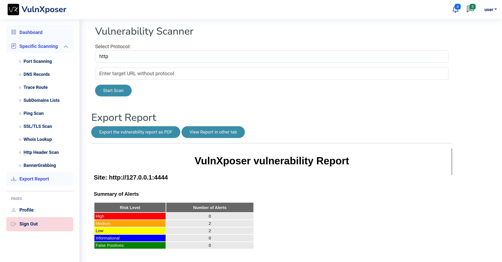

---

## Scan Interface

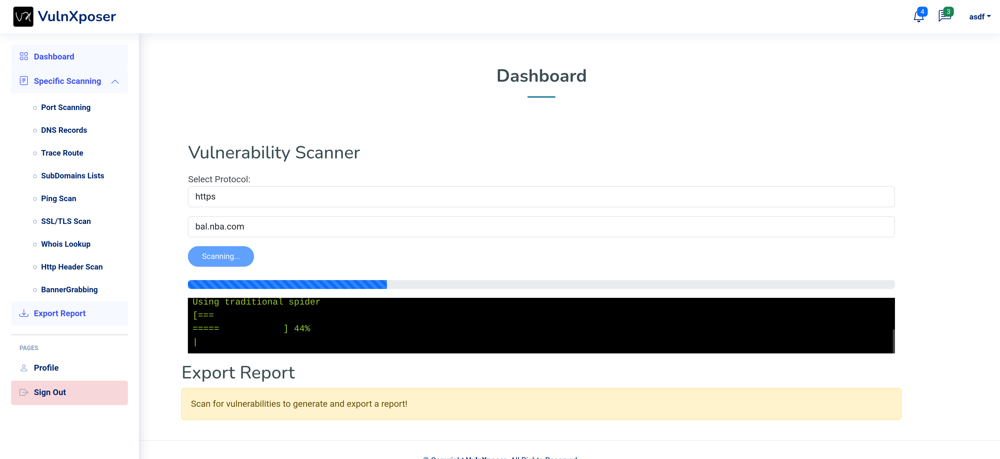

---

# Reconnaissance Modules

## Port Scanning

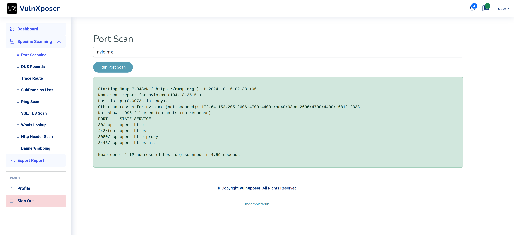

---

## Subdomain Enumeration

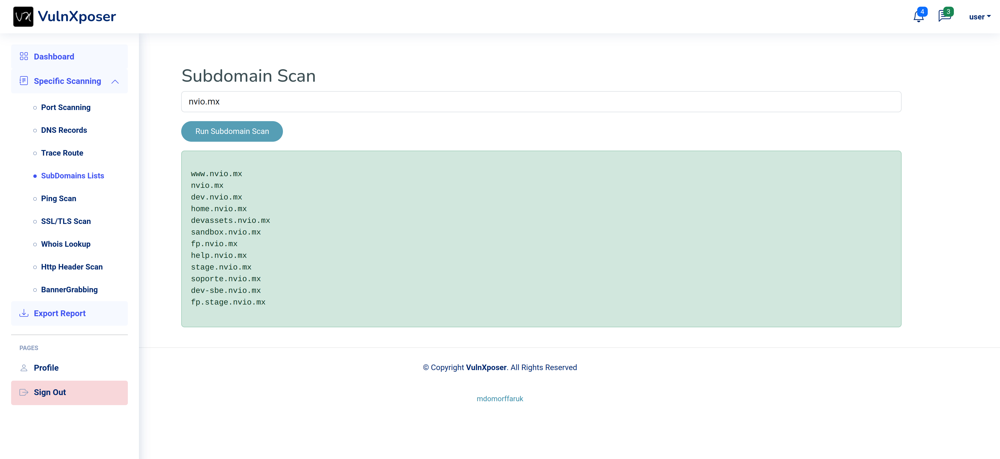

---

## DNS Analysis

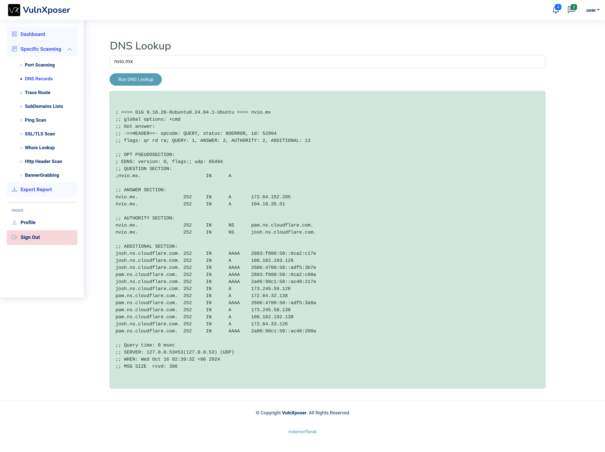

---

## HTTP Security Headers

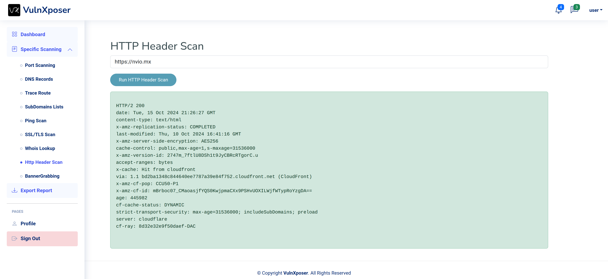

---

## SSL / TLS Security Check

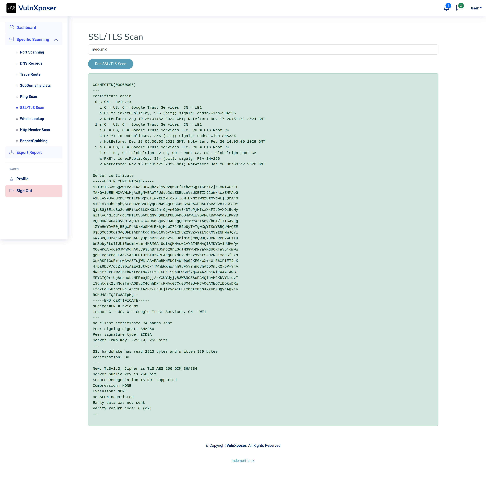

---

## Banner Grabbing

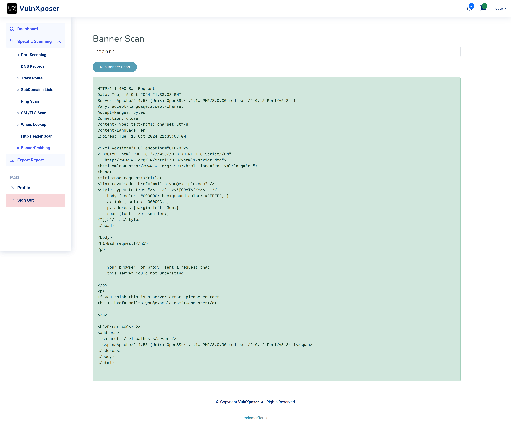

---

## Traceroute Network Path

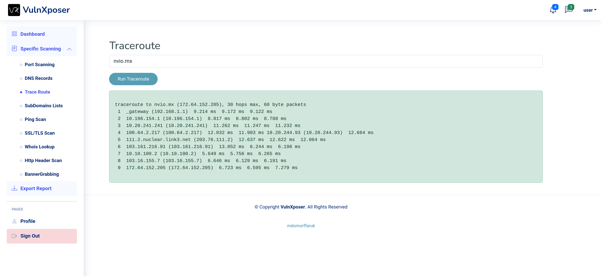

---

## Ping Connectivity Test

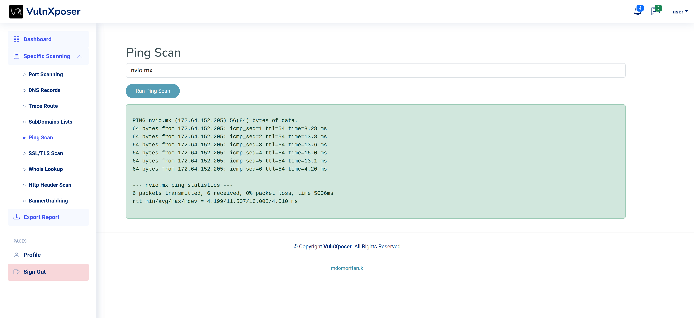

---

## WHOIS Lookup

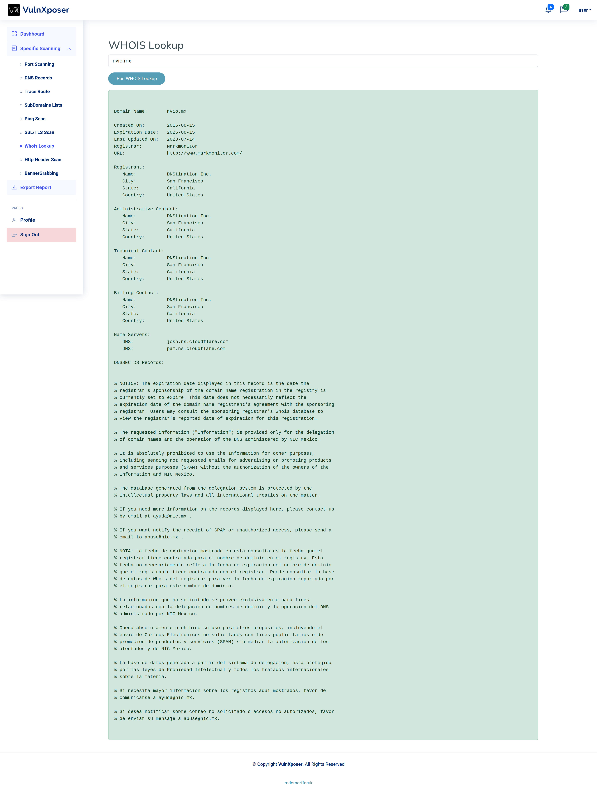

---

# Vulnerability Reporting

## Vulnerability Report

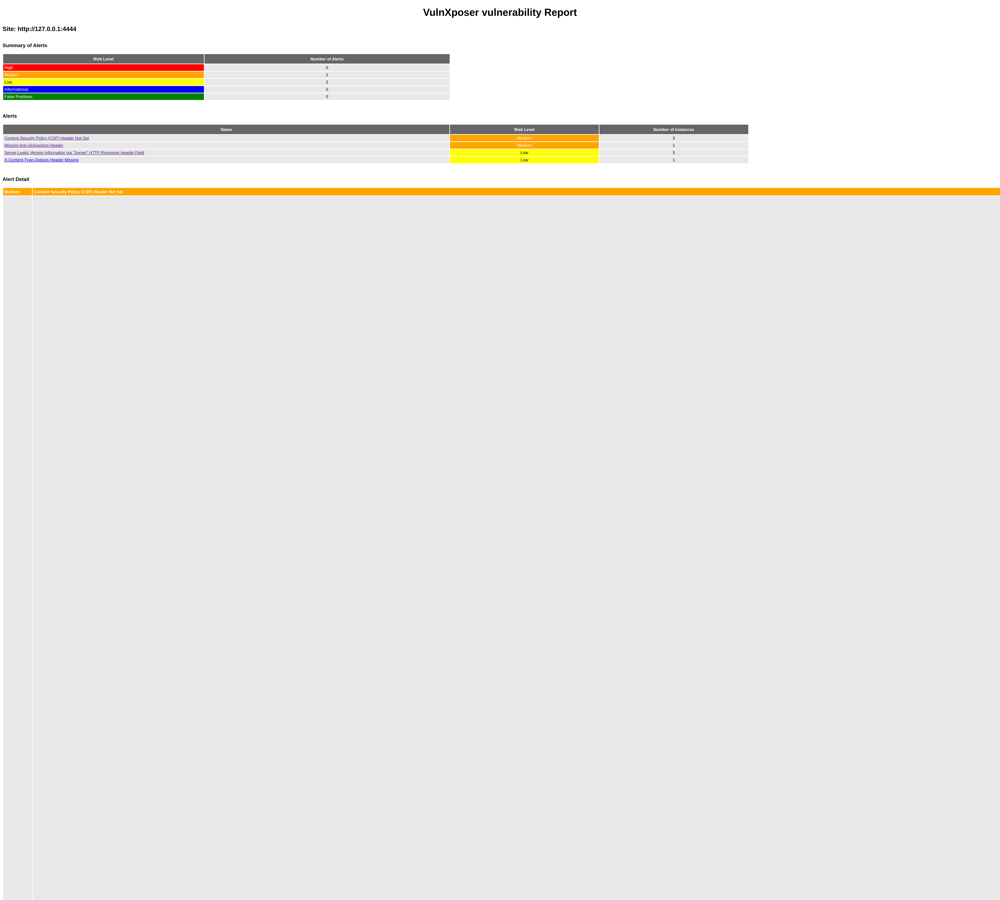

---

## Exported Security Report

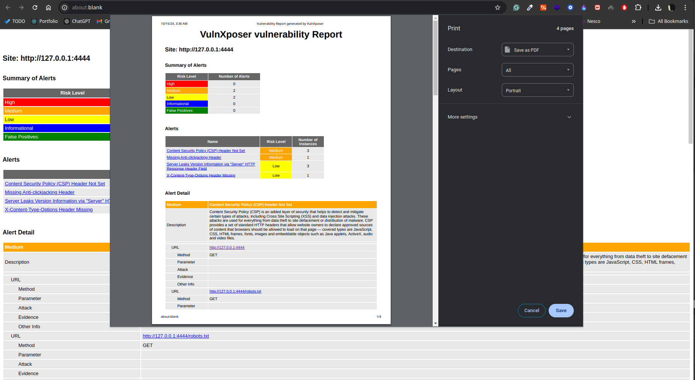

---

# Technologies Used

Frontend

- React.js
- Bootstrap

Backend

- Node.js
- Express.js

Security Tools

- OWASP ZAP
- Nmap
- Bash scripting

Database

- MySQL

---

# Purpose of the Project

The goal of VulnXposer is to assist developers and security researchers in identifying vulnerabilities before attackers exploit them.

The platform integrates reconnaissance tools and vulnerability scanners to provide a centralized security assessment workflow.

---

# Project Documentation

Detailed project documentation and system design are available in the [project report](project&#32;report.pdf).
